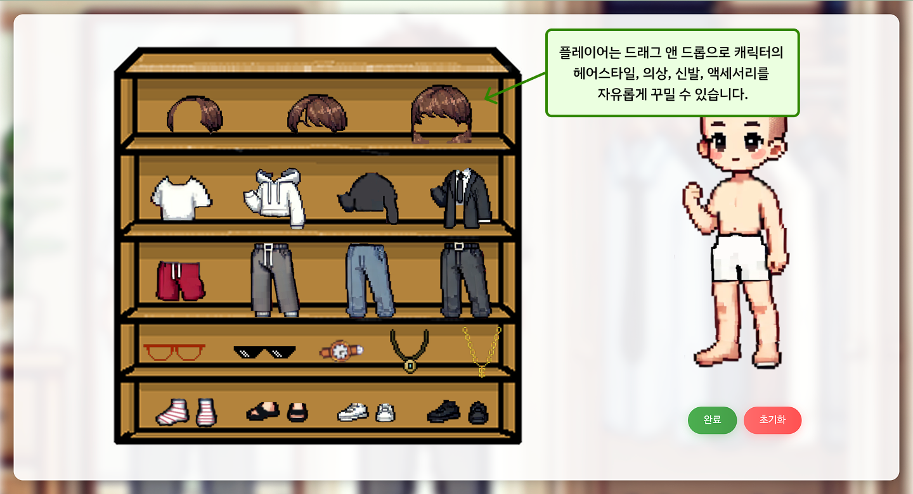
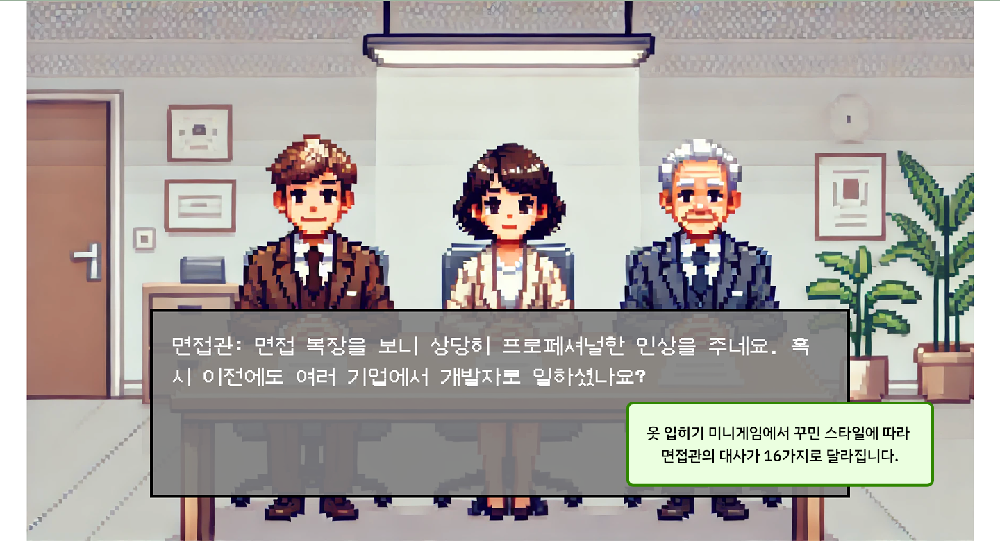

# 👔 DeveloperMaker FrontEnd Project

# 개발자 키우기

## 팀원 소개

|            <a href="https://github.com/jimin0304">박지민</a>            |            <a href="https://github.com/twogarlic">임하늘</a>            |            <a href="https://github.com/address0">주소영</a>            |            <a href="https://github.com/hurdong">허동민</a>            |
| :---------------------------------------------------------------------: | :---------------------------------------------------------------------: | :--------------------------------------------------------------------: | :-------------------------------------------------------------------: |
|  |  |  |  |

---

## 프로젝트 개요

이 프로젝트는 신입 개발자가 되고 싶은 주인공의 최종 면접을 시뮬레이션할 수 있는 게임입니다. 사용자가 선택한 선택지에 따라 사용자의 면접 점수가 결정되고, 이를 바탕으로 사용자의 면접 스타일을 분석해줍니다. 또한 면접 복장을 선택할 수 있는 '면접 옷 입히기' 미니 게임을 통해 사용자의 면접 복장 스타일도 파악할 수 있는 웹 페이지입니다.

## 기술 스택

- **HTML5**: 웹 페이지 구조
- **CSS3**: 스타일링
- **JavaScript**: 동적 기능 구현
- **html2canvas**: 캡처 기능

## 파일 구조

## 주요 기능

- **면접 스토리 진행**: 사용자는 다양한 면접 전후 상황에서 알맞은 선택지를 선택하여 면접 점수를 획득할 수 있습니다.
- **의상 선택**: 사용자는 다양한 의상을 드래그 앤 드롭하여 캐릭터에 적용할 수 있습니다.
- **캡처 기능**: 사용자가 선택한 의상을 캡처하여 이미지로 저장할 수 있습니다.
- **통계 기능**: 면접 결과를 면접 점수별 통계를 통해 상세 분석할 수 있습니다.

## 사용 방법

1. **시작하기**:

   - `index.html` 파일을 열어 전체 화면 설정 및 닉네임 설정을 하고 "START" 버튼을 클릭합니다.
     

2. **면접 전날**:

   - `base.html` 파일을 열어 면접 전날 스토리를 진행하며 자신에게 맞는 선택지를 선택합니다.
     
     

3. **기상**:

   - `Alarm.html` 파일을 열어 플레이어의 기상을 돕기 위해 진짜 알람 시계를 찾아 클릭합니다.
     

4. **의상 선택**:

   - `dressup.html` 페이지에서 다양한 의상을 선택하고 캐릭터에 드래그하여 적용합니다.
     
     

5. **출근길**:

   - `base.html`: 자신에게 맞는 선택지를 선택합니다.
     

6. **교통수단 안**:

   - `base.html`: 자신에게 맞는 선택지를 선택합니다.
     

7. **면접장**:

- `base.html`: 자신에게 맞는 선택지를 선택합니다.
  

8. **합격 불합격**:

- `ResultSucces.html`: 면접에 붙었을 때 나타납니다.
  
- `ResultFail.html`: 면접에 떨어졌을 때 나타납니다.
  

9. **결과창**:

- `FinalStats.html`: 면접 주요 데이터를 조회할 수 있습니다.
  
  
  
